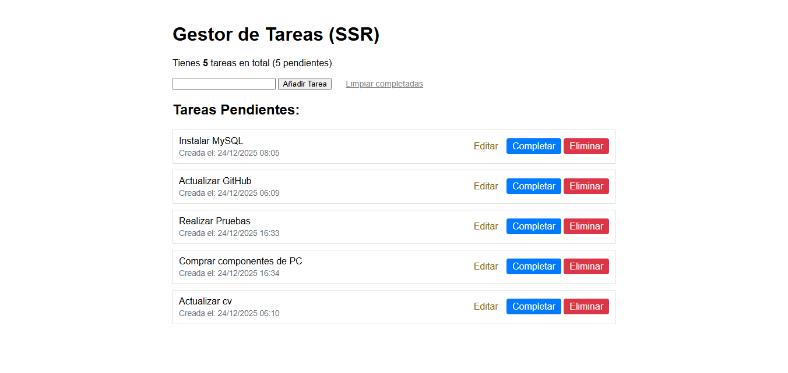
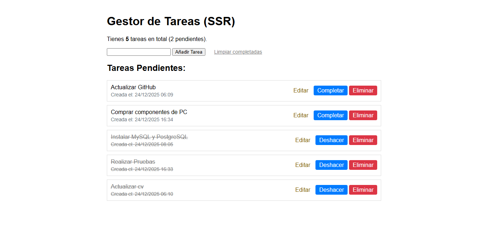
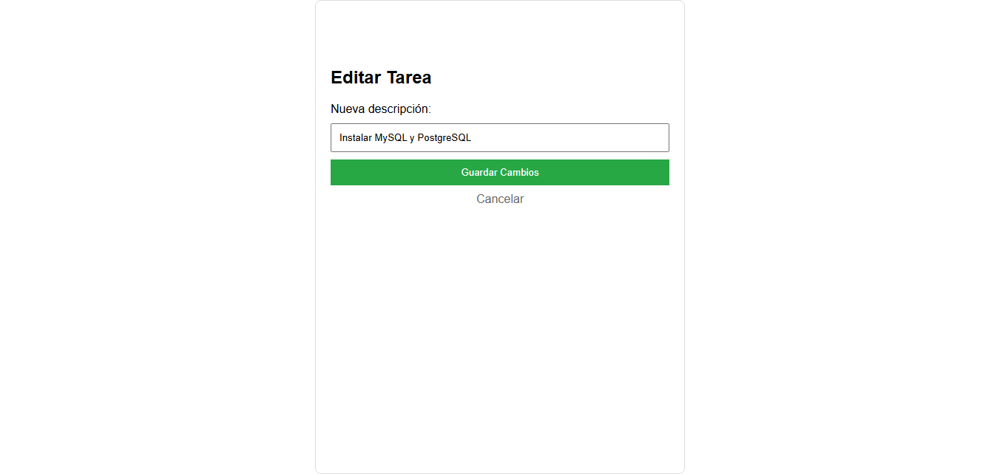

# Gestor de Tareas API REST (SSR con Thymeleaf)

Este proyecto de gestión de tareas desarrollado con Spring Boot y Java 21.
La aplicación implementa una arquitectura de Renderizado en el Servidor (SSR) utilizando Thymeleaf, lo que permite una interacción fluida con una base de datos PostgreSQL.

## Stack Tecnológico

* **Backend Framework:** Spring Boot 4.0.0
* **Lenguaje:** Java 21
* **Motor de Plantillas:** Thymeleaf (SSR)
* **Base de Datos:** PostgreSQL / Spring Data JPA con Hibernate
* **Build Tool:** Maven

## Configuración Inicial del Proyecto

El proyecto fue inicializado con Spring Initializr, utilizando la versión de Java **[21]** y las siguientes dependencias esenciales para la arquitectura RESTful:

* **Spring Web:** Para construir los endpoints y usar `@RestController`.
* **Spring Data JPA / PostgreSQL Driver:** Para la persistencia de datos.
* **Spring Boot DevTools:** Para un desarrollo más rápido. 

## Cómo Iniciar y Probar

1.  **Configuración del Backend:** Asegúrese de que la base de datos PostgreSQL esté configurada en `application.properties`.
2.  **Ejecutar el Backend:** Inicie la aplicación Spring Boot.
3.  **Acceso Web (Frontend):** Abra su navegador en `http://localhost:8080/tareas`.

## Interfaz de Usuario (Frontend Renderizado con Thymeleaf)

**Panel Principal de Tareas:** Vista general de la aplicación. Presenta el listado completo de tareas almacenadas, mostrando la 
descripción, la fecha y hora exacta de creación y un encabezado con el conteo automático de tareas totales y pendientes.

 

## Gestión de Estados 

Muestra la interacción con las tareas individuales. Los usuarios pueden marcar como una tarea finalizada haciendo clic en
**Completar**, lo que aplica un estilo visual de tachado y actualiza el contador  de pendientes en tiempo real. Tambien permite
**Deshacer** la acción o realizar una **Limpieza de completadas**

 

## Modulo de Edición

Interfaz dedicada para la modificación de resgistros. Al seleccionar una tarea, el sistema redirige a este formulario que 
precarga la descripción actual, permitiendo al usuariio realizar ajustes y guardar los cambios sin alterar la fecha de 
creación original.

 

