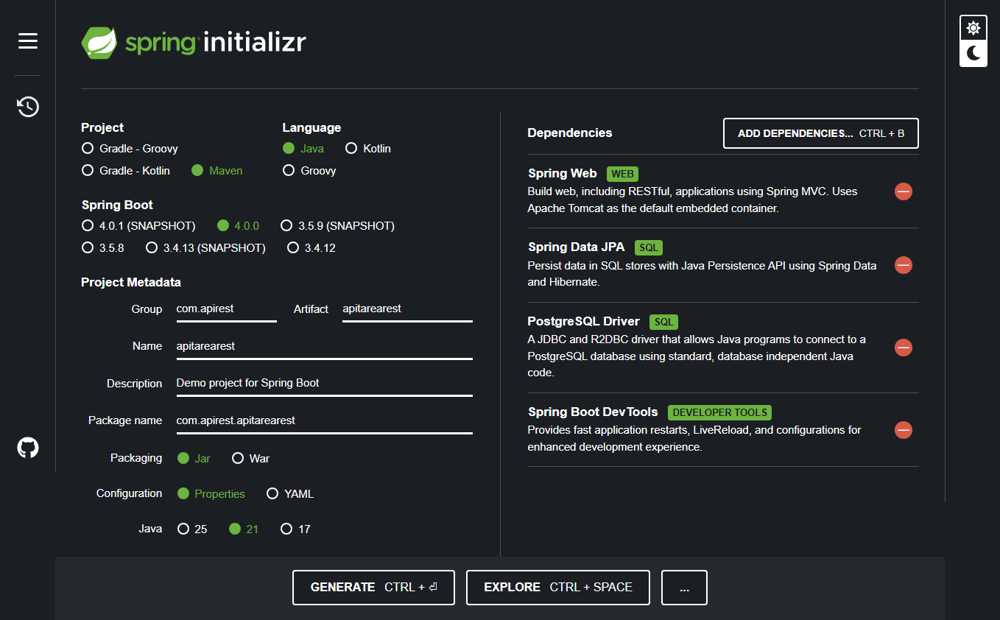
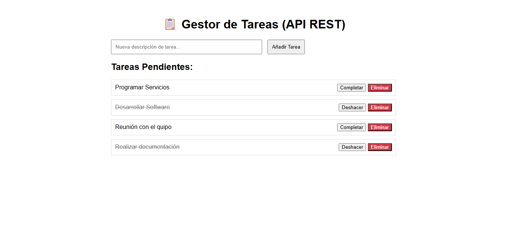
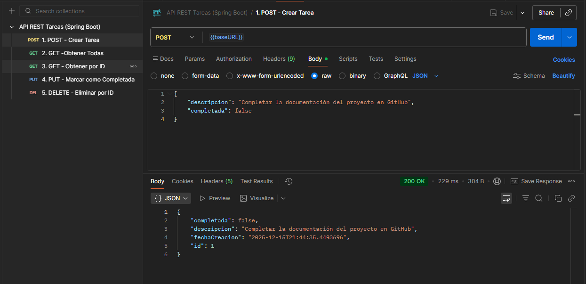

# API RESTful de Gestión de Tareas (Full-Stack Desacoplado)

Este proyecto implementa una API REST completa para la gestión de tareas, con un frontend simple desarrollado en JavaScript puro (Fetch API) que consume los servicios. Demuestra un diseño de arquitectura desacoplada (Frontend/Backend).

## Stack Tecnológico

* **Backend Framework:** Spring Boot 3.x
* **API:** RESTful (JSON) con @RestController
* **Base de Datos:** PostgreSQL / Spring Data JPA
* **Frontend:** HTML/CSS/JavaScript (Fetch API)
* **Herramientas de Prueba:** Postman
* **Build Tool:** Maven

## Configuración Inicial del Proyecto

El proyecto fue inicializado con Spring Initializr, utilizando la versión de Java **[21]** y las siguientes dependencias esenciales para la arquitectura RESTful:

* **Spring Web:** Para construir los endpoints y usar `@RestController`.
* **Spring Data JPA / PostgreSQL Driver:** Para la persistencia de datos.
* **Spring Boot DevTools:** Para un desarrollo más rápido.

## Arquitectura y Funcionalidad

El proyecto se compone de dos capas principales comunicadas vía HTTP:

1.  **Backend (API REST):** Maneja la persistencia y la lógica de negocio.
    * **Manejo de Errores:** Implementación de la excepción para retornar `404 Not Found` en lugar de `500 Internal Server Error` cuando un recurso no existe, siguiendo los estándares REST.
    * **Entidad Tarea:** Posee `descripcion`, `completada` (boolean) y `fechaCreacion`.
2.  **Frontend (SPA):** Interfaz simple que utiliza la `Fetch API` de JavaScript para:
    * Cargar tareas al inicio (GET).
    * Crear tareas (POST).
    * Alternar el estado de completado (PUT).
    * Eliminar tareas (DELETE).

### Endpoints de la API

| Verbo HTTP | URI | Descripción |
| :--- | :--- | :--- |
| **GET** | `/api/v1/tareas` | Obtiene la lista completa de tareas. |
| **GET** | `/api/v1/tareas/{id}` | Obtiene una tarea específica. |
| **POST** | `/api/v1/tareas` | Crea una nueva tarea. (Requiere body JSON) |
| **PUT** | `/api/v1/tareas/{id}` | Actualiza completamente el estado de la tarea. (Requiere body JSON) |
| **DELETE** | `/api/v1/tareas/{id}` | Elimina una tarea de la base de datos. |

## Cómo Iniciar y Probar

1.  **Configuración del Backend:** Asegúrese de que la base de datos PostgreSQL esté configurada en `application.properties`.
2.  **Ejecutar el Backend:** Inicie la aplicación Spring Boot.
3.  **Acceso Web (Frontend):** Abra su navegador en `http://localhost:8080/`.
4.  **Prueba de la API (Postman):** Importe la colección de Postman para probar los endpoints directamente.

## Interfaz de Usuario (Frontend Desacoplado)

La interfaz simple utiliza JavaScript para consumir la API y actualizar la lista en tiempo real.

 

## Testing y Documentación con Postman

La API fue probada exhaustivamente usando Postman. La siguiente imagen muestra la estructura de la colección utilizada para validar cada uno de los endpoints CRUD (GET, POST, PUT, DELETE).

